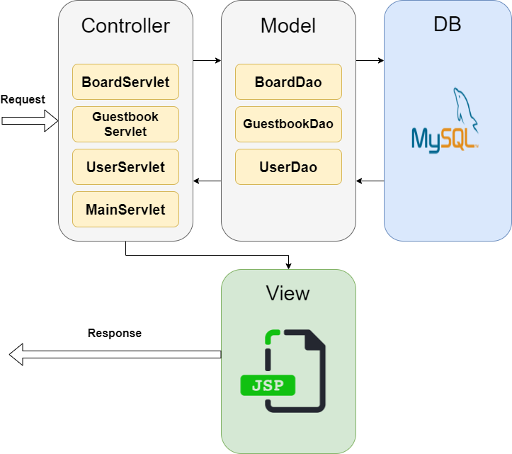
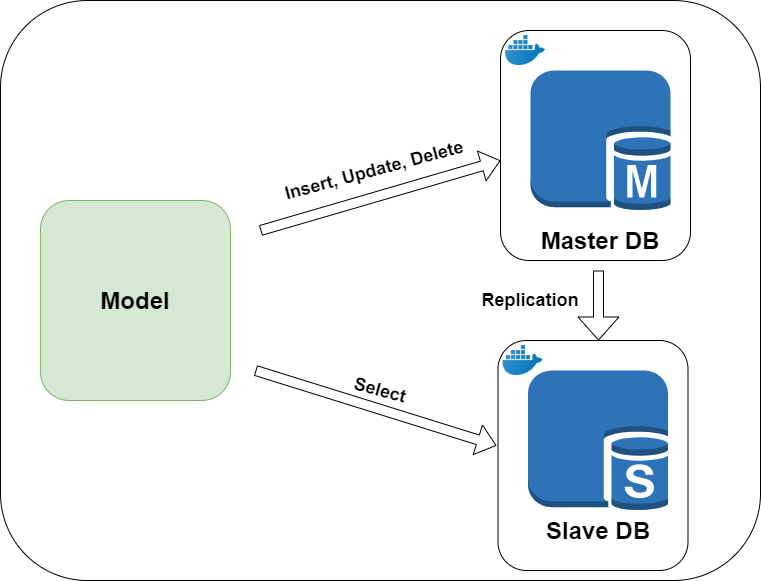

# JSP servlet Model 2 MVC site + DB 이중화

* 게시판 사이트
* 210313 ~ 210318
* 기능
	* 회원
	  * 등록, 수정, 로그인 / 로그아웃
	* 방명록
		  * 글쓰기, 전체 목록보기, 삭제 
	* 게시판
	  * 쓰기, 읽기, 수정, 삭제
	  * 페이징, 조회수 증가, 답글 달기
	  * 키워드 검색(제목, 본문, 닉네임)
* keyword
  * JSP, Servlet, MySQL, JDBC, MVC, JSTL, EL, Git
* version
  * DB : MySQL 8.0.23 (JDBC 연동)
  * WAS : Tomcat 8.5.63
* Architecture 




## DB 생성 SQL

user 부터 순서대로 생성 한다.

* user table

```
-- 회원
CREATE TABLE `user` (
	`no`        INT UNSIGNED           NOT NULL COMMENT '번호', -- 번호
	`name`      VARCHAR(50)            NOT NULL COMMENT '이름', -- 이름
	`email`     VARCHAR(200)           NOT NULL COMMENT '이메일', -- 이메일
	`password`  VARCHAR(20)            NOT NULL COMMENT '비밀번호', -- 비밀번호
	`gender`    ENUM('male','female') NOT NULL COMMENT '성별', -- 성별
	`join_date` DATETIME               NOT NULL COMMENT '가입일' -- 가입일
)
COMMENT '회원';

-- 회원
ALTER TABLE `user`
	ADD CONSTRAINT `PK_user` -- 회원 기본키
		PRIMARY KEY (
			`no` -- 번호
		);

ALTER TABLE `user`
	MODIFY COLUMN `no` INT UNSIGNED NOT NULL AUTO_INCREMENT COMMENT '번호';
```

* guestbook

```
-- 방명록
CREATE TABLE `guestbook` (
	`no`       INT UNSIGNED NOT NULL COMMENT '번호', -- 번호
	`name`     VARCHAR(50)  NOT NULL COMMENT '이름', -- 이름
	`password` VARCHAR(20)  NOT NULL COMMENT '비밀번호', -- 비밀번호
	`contents` TEXT         NOT NULL COMMENT '내용', -- 내용
	`reg_date` DATETIME     NOT NULL COMMENT '등록일' -- 등록일
)
COMMENT '방명록';

-- 방명록
ALTER TABLE `guestbook`
	ADD CONSTRAINT `PK_guestbook` -- 방명록 기본키
		PRIMARY KEY (
			`no` -- 번호
		);

ALTER TABLE `guestbook`
	MODIFY COLUMN `no` INT UNSIGNED NOT NULL AUTO_INCREMENT COMMENT '번호';
```

* 게시판

```
-- 게시글
CREATE TABLE `board` (
	`no`       INT UNSIGNED NOT NULL COMMENT '글번호', -- 글번호
	`user_no`  INT UNSIGNED NOT NULL COMMENT '회원번호', -- 회원번호
	`title`    VARCHAR(50)  NOT NULL COMMENT '타이틀', -- 타이틀
	`group_no` INT UNSIGNED NOT NULL COMMENT '그룹번호', -- 그룹번호
	`order_no` INT UNSIGNED NOT NULL COMMENT '그룹내 순서', -- 그룹내 순서
	`depth`    INT UNSIGNED NOT NULL COMMENT '글의 깊이', -- 글의 깊이
	`contents` TEXT         NOT NULL COMMENT '내용', -- 내용
	`reg_date` DATETIME     NOT NULL COMMENT '등록일', -- 등록일
	`views`    INT UNSIGNED NOT NULL DEFAULT 0 COMMENT '조회수' -- 조회수
)
COMMENT '게시글';

-- 게시글
ALTER TABLE `board`
	ADD CONSTRAINT `PK_board` -- 게시글 기본키
		PRIMARY KEY (
			`no` -- 글번호
		);

ALTER TABLE `board`
	MODIFY COLUMN `no` INT UNSIGNED NOT NULL AUTO_INCREMENT COMMENT '글번호';

-- 게시글
ALTER TABLE `board`
	ADD CONSTRAINT `FK_user_TO_board` -- 회원 -> 게시글
		FOREIGN KEY (
			`user_no` -- 회원번호
		)
		REFERENCES `user` ( -- 회원
			`no` -- 번호
		)
		ON DELETE NO ACTION;
```


# DB 이중화(replication)



* 상세 - DB 이중화를 통한 부하 분산
  * docker container 사용해서 mysql master db, slave db를 생성, 이중화 
  * master 에서는 insert, update, delete 수행
  * slave에서는 select만  수행
* link - 
* 적용된 commit
  * https://github.com/kaiphojor/servlet-practices/commit/866ae6742a490f201479325407dc9edca10c4af6

* 참고

  * https://jupiny.com/2017/11/07/docker-mysql-replicaiton/

  

