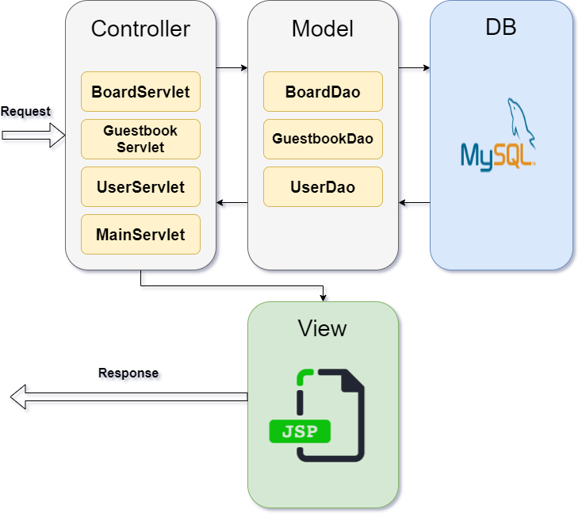

### JSP servlet Model 2 MVC site 

* 게시판 사이트
* 210313 ~ 210319
* 기능
	* 회원
	  * 등록, 수정, 로그인 / 로그아웃
* 방명록
	  * 글쓰기, 전체 목록보기, 삭제 
	* 게시판
	  * 쓰기, 읽기, 수정, 삭제
	  * 페이징, 조회수 증가, 답글 달기
	  * 키워드 검색
* keyword
  * JSP, Servlet, MySQL, JDBC, MVC, JSTL, EL, Git
* version
  * DB : MySQL 8.0.23 (JDBC 연동)
  * WAS : Tomcat 8.5.63
* Architecture 




* docs/user_DDL.sql , docs/guestbook_DDL.sql , docs/board_DDL.sql  - DB 순차 생성
* 
```
DB의 password 암호화

답글있는 글의 삭제된 글입니다. 이것은 어덯게 ㅍ현하는가? 

readme 수정 -> DB 테이블 

## prerequisite

make user table
```
```